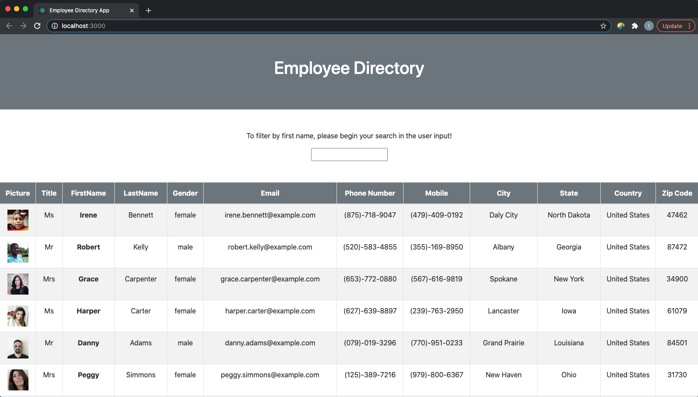

# Employee Directory App
This site was developed with the intention of creating a employee directory application that allows an employer to view non-sensitive data about other employees. Users are able to sort the table by at least one category and filter the users by at least one property. 

## Motivation
The motivation behind this project was to create an application utilizing React.js and the Random User API, which deploys to Heroku.

## Tech/Framework Used
* Node.js
* React.js
* React-Bootstrap
* Bootstrap
* Axios
* Random User API
* HTML
* Javascript
* JSON
* Heroku
* Built with Visual Code Studio

## Code Example
Here is an example of the "Employee Directory" application:

## Features
* Sort the table by at least one category
* Filter the users by at least one property

## Installation
If choosing to run locally, clone this repository to your machine or download zip file.

## Usage
After the repository has been cloned, use terminal to change directories into "Fitness-Tracker" directory. Run the command "node server.js" and then view http://localhost:3000/. Otherwise, the app can be accessed live at the Heroku link provided below. 

## License 

> You can reference the full license [here](https://github.com/Picke1id/Employee-Directory/blob/master/LICENSE).

This project is licensed under the terms of the MIT license.

## Link
* Heroku Deployment: (https://floating-retreat-50180.herokuapp.com)
